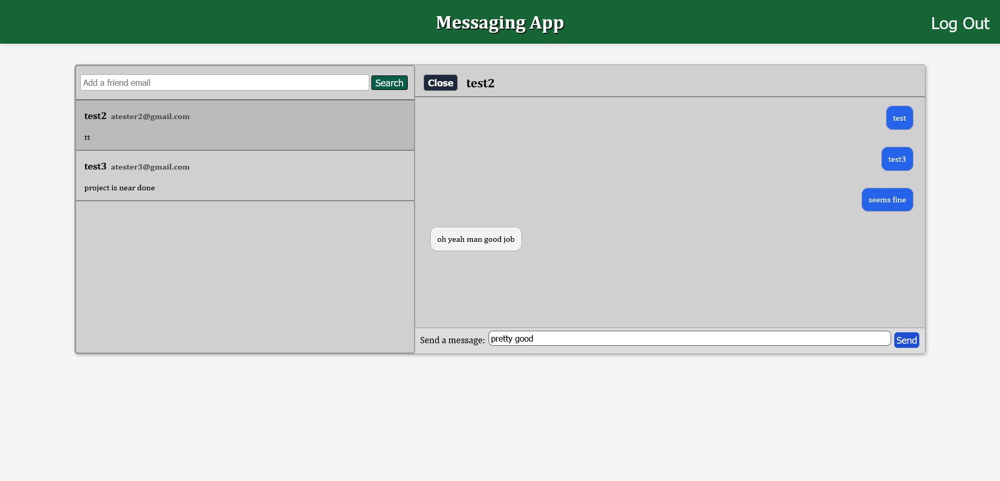

# Messaging App

This is the next of my series of front-end projects, which uses Node for the back-end and React for the front-end. This site is a simple messaging app. You can search a email for a friend that you want to talk with, and then write messages to them, as well as edit your profile status. I still have not implemented automatic chat updates however, but I might do it in the future.

Either way, as always, I started this project with the general CSS layout and the Sign-up/Log-in functions. Fortunately, I still had the functions for user authentication from my previous projects, so I saved a lot of time by reusing most of my code. Afterwards I moved on to the search functions and selecting different chats, and finished it off by implementing the messages functionalities.

This project was not very complex or overly difficult to finish, but it still did take me a while (full-stack is extensive) and I learned a lot from it. It was significantly easier than some previous projects since I had earned some good experience from those previous projects.

This project is part of the [The Odin Project](https://www.theodinproject.com/) online NodeJS course. In fact it is the second-to-last project in that course. Which means I will now be working on the final project!
